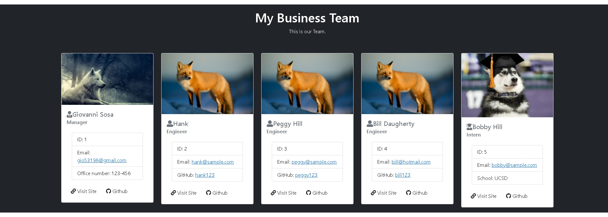

# TeamProfileGenerator


## Description
Node.JS command line application that generates a TeamProfile HTML page from the information provided.
## Table of contents

* [Description](#description)
* [Installation](#installation)
* [Usage Information](#usage)
* [License](#license) 
* [Contribution](#contribution)
* [GitHub Repo](#GitHub)
* [Images/Videos](#Images)
* [Contact Info](#questions)

## Installation
Run the following command for proper installation of dependencies:
```
    npm install
```

## Usage Information
The first step is to open the indicated file (index.js) in an integrated terminal. 
Using Node.js, we use the following command:
```
node index.js 
```

## License
This Project is licensed under [MIT](https://opensource.org/licenses/MIT)

## Contribution Guidelines
Thanks to:
* [https://codepen.io/nikki-peel/pen/RwavQer](https://codepen.io/nikki-peel/pen/RwavQer)
* [https://www.geeksforgeeks.org/node-js-fs-existssync-method/] (https://www.geeksforgeeks.org/node-js-fs-existssync-method/)
* [google.com](google.com)
* [https://getbootstrap.com/](https://getbootstrap.com/)
* [https://www.w3schools.com/bootstrap4/bootstrap_containers.asp](https://www.w3schools.com/bootstrap4/bootstrap_containers.asp)
* [https://expressjs.com/](https://expressjs.com/)

## GitHub Repo
* [https://github.com/gisosa531/TeamProfileGenerator](https://github.com/gisosa531/TeamProfileGenerator)

## Images/Videos
* Part 1: Initializing and running app


https://user-images.githubusercontent.com/84998291/137575162-e4a051dd-8e55-46b5-8d1a-00d8f20951b5.mp4


* Part 2: Adding Data and Rendering page


https://user-images.githubusercontent.com/84998291/137575336-4ab4c9f1-8a1f-4fd6-baac-fd82c2cf2b5b.mp4


Sample Page:



* Part 2: Tests Section


https://user-images.githubusercontent.com/84998291/137575260-741f1fb6-7542-4542-90b9-eb9e8c66c313.mp4


## Contact Information
If you have any problems concerning the repo, please file an issue or email me at 
gio53196@gmail.com
The link to my work repositories is 
[Github Profile](https://github.com/gisosa531/).
